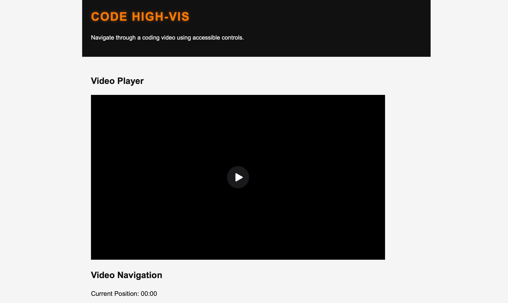
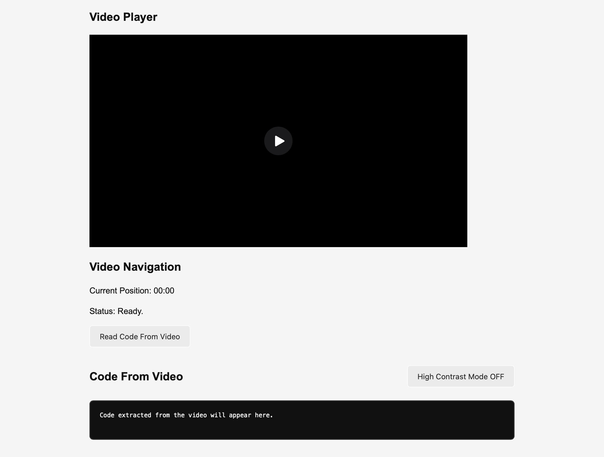
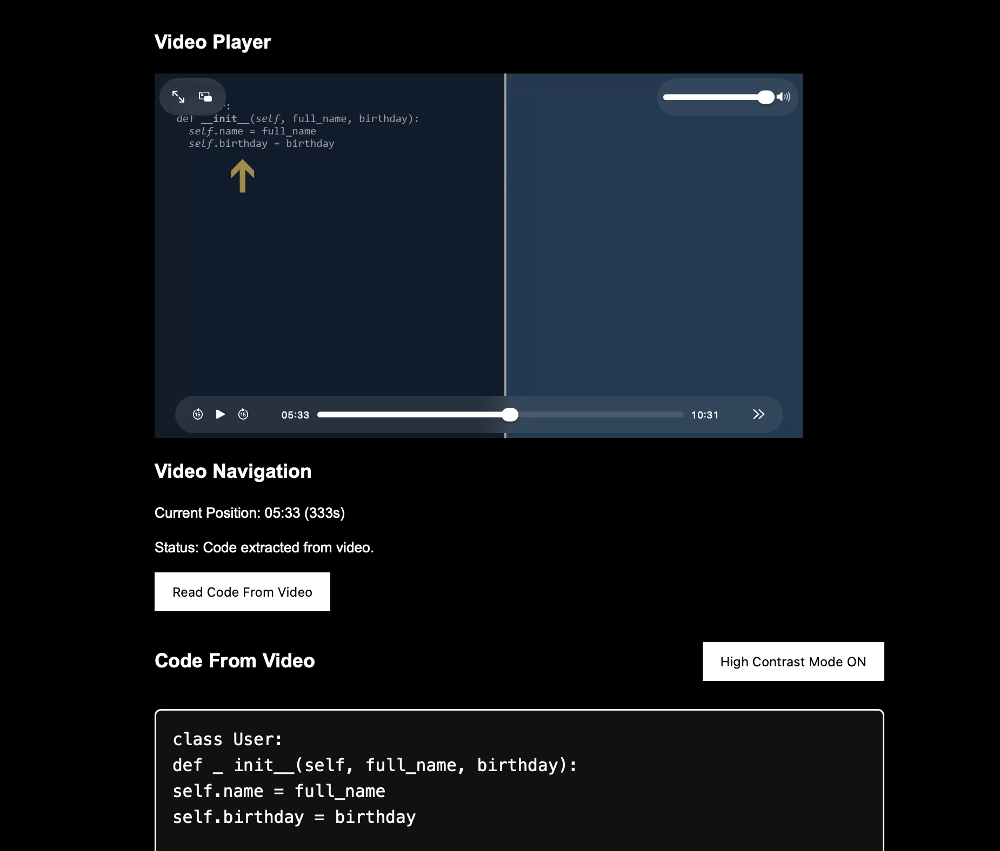

# CODE HIGH-VIS


## Overview

CODE HIGH-VIS is an OCR-assisted learning application that helps users navigate coding videos and extract source code directly from video frames.

The project was developed as part of the Diploma of Information Technology (Advanced Programming) and demonstrates the use of FastAPI, OCR, computer vision, accessibility-focused design, client/server architecture and third-party library integration.


## Assessment Alignment

This project supports the learning outcomes of ICTPRG535 and ICTPRG547 by demonstrating third-party library usage, OCR integration, API development, accessibility considerations, and client/server communication.

## Application Preview





## Why This Project?

This project demonstrates:

- Third-party library integration
- OCR processing using Tesseract
- Computer vision using OpenCV
- REST API development with FastAPI
- Client/server communication
- Accessibility-focused UI design
- High contrast mode personalisation

## Features

- Video playback and navigation
- OCR extraction from video frames
- Read Code From Video functionality
- High Contrast Mode
- Accessible user interface
- FastAPI REST endpoints
- Responsive web interface

## Technology Stack

### Backend

- Python
- FastAPI
- Uvicorn
- Pydantic

### OCR and Computer Vision

- OpenCV
- Tesseract OCR
- pytesseract
- NumPy

### Frontend

- HTML5
- CSS3
- JavaScript

### Development Tools

- Git
- GitHub
- UV
- Ruff

## Project Structure

```text
preliminary/
├── simple_api.py
└── library_basics.py

frontend/
├── index.html
├── style.css
└── app.js

resources/
└── oop.mp4
```

## Installation

### Install Tesseract OCR

pytesseract requires the Tesseract OCR engine to be installed separately.

macOS:

```bash
brew install tesseract
```

Verify installation:

```bash
tesseract --version
```

### Install Project Dependencies

```bash
uv sync
```

## Running Locally

Start the FastAPI development server:

```bash
uv run fastapi dev preliminary/simple_api.py
```

Open your browser:

```text
http://127.0.0.1:8000
```

Interactive API documentation:

```text
http://127.0.0.1:8000/docs
```

## API Endpoints

### List available videos

```http
GET /video
```

### Get video metadata

```http
GET /video/{video_id}
```

### Extract a video frame

```http
GET /video/{video_id}/frame/{seconds}
```

### Extract OCR text

```http
GET /video/{video_id}/frame/{seconds}/ocr
```

## Accessibility Features

- Semantic HTML structure
- ARIA labels
- High Contrast Mode
- OCR output readability improvements
- Keyboard-friendly controls
- Accessible status feedback

## Learning Resources and References

- FastAPI: https://fastapi.tiangolo.com/
- OpenCV: https://opencv.org/
- Tesseract OCR: https://tesseract-ocr.github.io/
- pytesseract: https://pypi.org/project/pytesseract/
- NumPy: https://numpy.org/
- Uvicorn: https://www.uvicorn.org/
- UV: https://docs.astral.sh/uv/
- Ruff: https://docs.astral.sh/ruff/

## Possible Future Improvements

- Upload custom videos
- OCR history
- Multiple OCR languages
- Download extracted code
- Improved OCR preprocessing